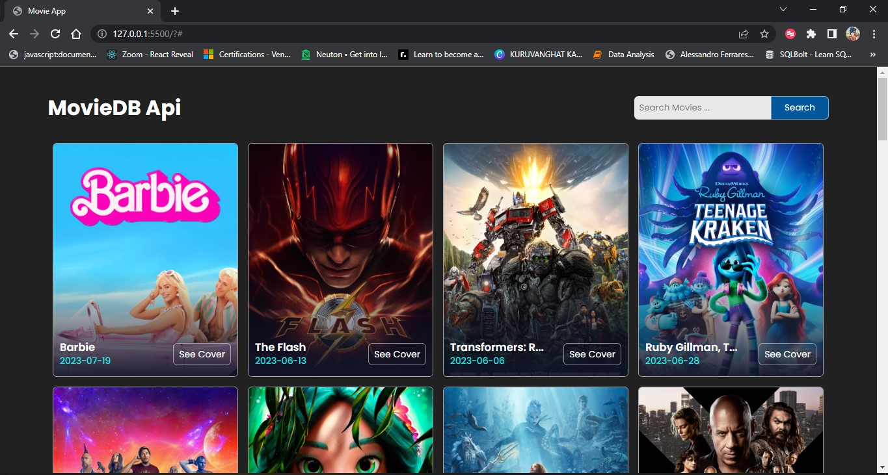

# Movie App

The Movie App is a web application that allows users to search for movies using The Movie Database (TMDb) API. Users can enter keywords related to movies, and the app will display a list of relevant movies along with their details.

## Table of Contents

- [Introduction](#movie-app)
- [Table of Contents](#table-of-contents)
- [Demo](#demo)
- [Features](#features)
- [Technologies Used](#technologies-used)
- [Installation](#installation)
- [Usage](#usage)

## Demo

[Link to Live Demo](https://www.example.com/movie-app](https://harshak-1744.github.io/Movie-App/))

## Preview


## Features

- Search for movies using keywords
- Infinite scrolling to load more search results
- Movie cards displaying movie information and cover images
- Responsive design for various devices
- See additional details for each movie by clicking on the movie card
- Ability to view the movie cover image in a new tab

## Technologies Used

- HTML5, CSS3, JavaScript
- [The Movie Database (TMDb) API](https://www.themoviedb.org/documentation/api)
- Font: [Poppins](https://fonts.google.com/specimen/Poppins) from Google Fonts

## Installation

1. Clone the repository to your local machine using the following command:

```bash
git clone https://github.com/your-username/movie-app.git
```

2. Open the project directory:

```bash
cd movie-app
```

## Usage

1. Open the `index.html` file in your web browser.
2. Use the search box to enter keywords related to movies you want to search.
3. Press the "Search" button or hit Enter to view the search results.
4. Scroll down to load more search results automatically.
5. Click on a movie card to see additional details about the movie and the movie cover image in a new tab.

